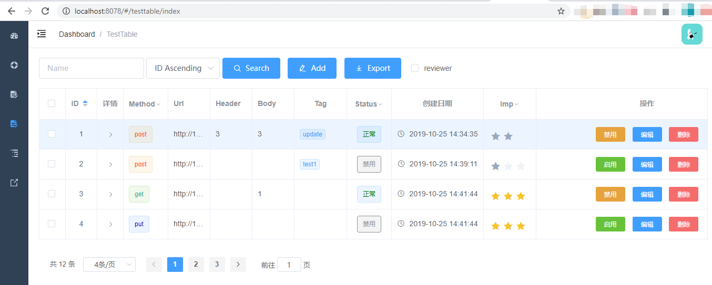
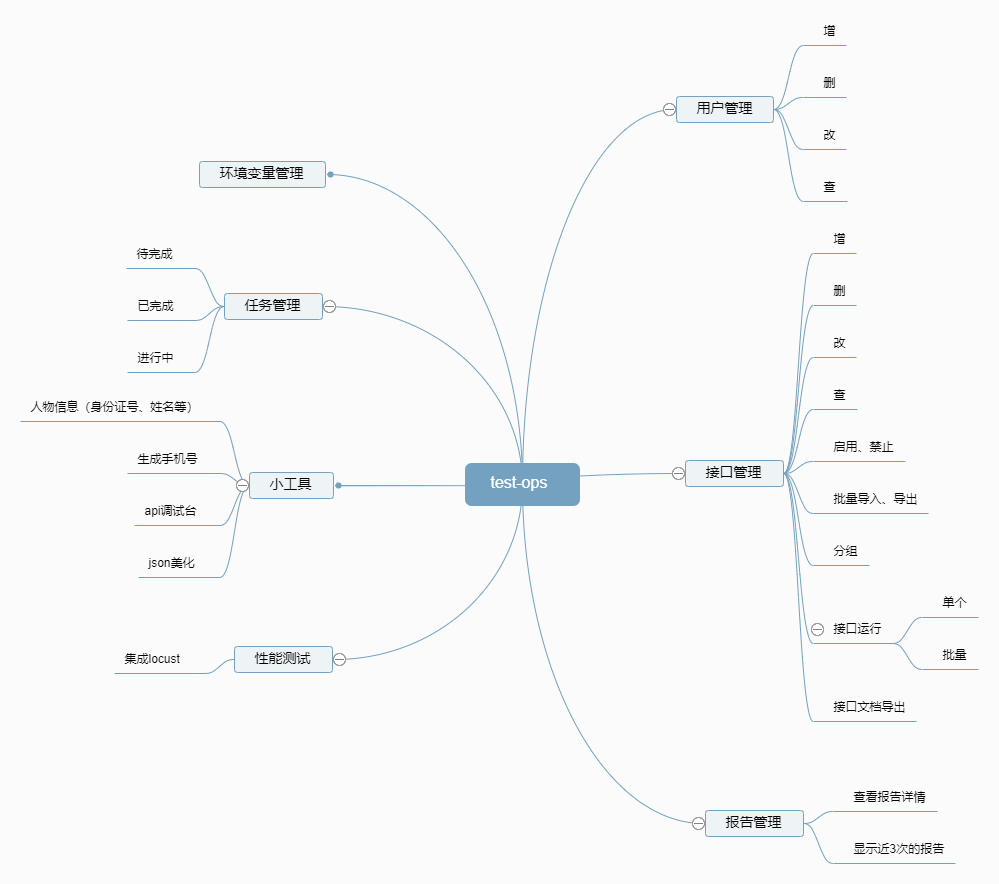

###### front

```
# install dependency
npm install

# develop
npm run dev
```

###### backend

在项目目录下使用virtulenv:
`virtualenv --no-site-packages venv`,将会自动创建venv目录，
参数`--no-site-packages`强制不将已经安装到Python系统内的任何第三方包复制过来，使得新的venv完全纯净。

然后安装依赖包 `pip install -r requirements.txt`

最有运行 `python app.py`

测试用例：



系统初步草图：